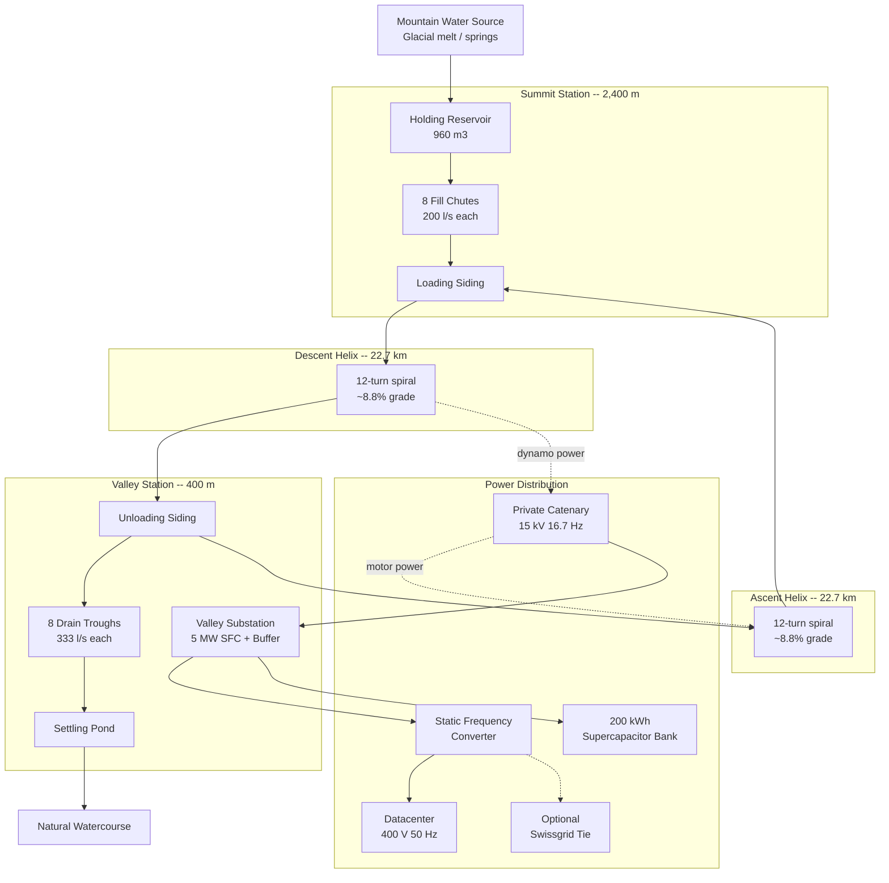
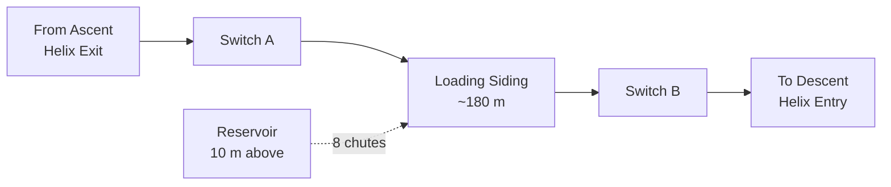
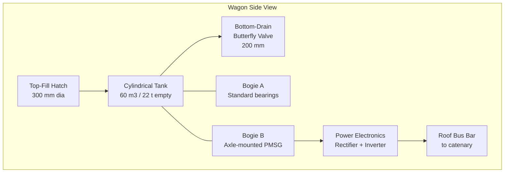
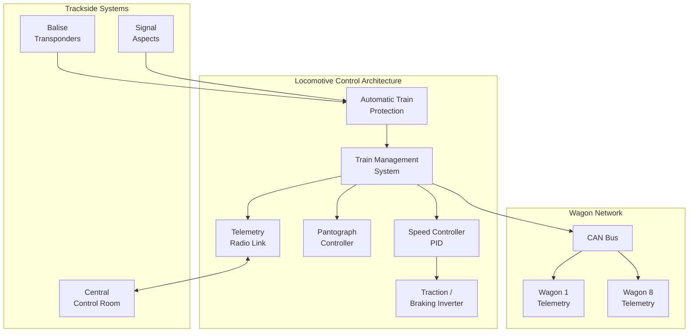
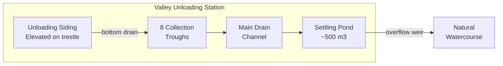
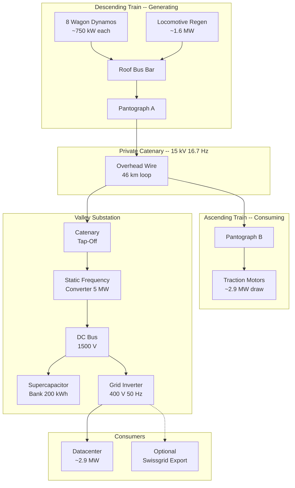

# Infinitrain -- Architectural Design

Conceptual engineering design for all five Infinitrain subsystems: summit loading station, wagon system, locomotive, valley unloading station, and power grid attachment.

This document describes **what** each subsystem does, **how** the parts connect, and the **key specifications** that size each component. It is a feasibility-level design -- enough to validate that every piece has a plausible real-world counterpart.

---

## System Overview



**Water cycle** (solid lines): Mountain source fills the reservoir. Chutes gravity-load the train. The loaded train descends. At the valley, bottom-drain valves empty into troughs. Water flows to a settling pond and returns to the natural watercourse. The empty train ascends back to the summit.

**Electrical cycle** (dashed lines): Wagon dynamos generate power on descent and feed the private catenary. The ascending train's motors draw from the same catenary. Surplus flows to the valley substation, through a static frequency converter, and into the datacenter at standard 400 V 50 Hz.

---

## 1. Summit Loading Station (2,400 m)

### Water Source and Storage

The station sits at the summit of a mountain with a natural water supply -- glacial meltwater, snowmelt, or mountain springs. Water is collected into a holding reservoir positioned **above track level** so that loading is entirely gravity-fed. No pumps are needed.

| Parameter | Value |
|-----------|-------|
| Reservoir capacity | 960 m3 (2x one train fill) |
| Reservoir elevation above rail | ~10 m |
| Hydrostatic pressure at chute outlet | ~1 bar (0.98 bar at 10 m head) |
| Minimum source inflow | 8 l/s (to refill between cycles, ~70 min) |
| Overflow | Returns to natural watercourse via spillway |

The reservoir is sized at 2x one full train load (2 x 480 m3 = 960 m3). This ensures that while one train is being loaded, the reservoir is already refilling for the next. A simple concrete or excavated basin with a waterproof liner suffices -- roughly 20 m x 16 m x 3 m deep.

### Fill Mechanism

Each of the 8 wagons has a top-fill hatch. Above each wagon stopping position, an overhead chute delivers water from the reservoir.

| Parameter | Value |
|-----------|-------|
| Total fill mass | 480 t (8 wagons x 60 t) |
| Fill time | 300 s (5 minutes) |
| Total flow rate | 1,600 l/s |
| Per-chute flow rate | 200 l/s |
| Chute diameter | ~250 mm (for 200 l/s at ~4 m/s) |
| Valve type | Pneumatic gate valve (binary open/close) |
| Fill detection | Overflow sensor at wagon hatch rim |

The chutes are simple gravity pipes running from the reservoir down to each wagon position. A pneumatic gate valve at each chute opens simultaneously when the train is positioned. Filling is unmetered -- each wagon fills to its overflow point (60 m3) and the excess returns to the reservoir via a collection gutter.

### Track Layout



The loading siding is a straight section of ~180 m (enough for locomotive + 8 wagons at ~20 m spacing). Two switches connect it to the helix tracks:

- **Switch A** (entry): from the ascent helix exit to the siding
- **Switch B** (exit): from the siding to the descent helix entry

Balise transponders embedded in the rail trigger the train's automation system to stop at the correct position for chute alignment. Position accuracy: +/- 0.5 m (standard for automated freight systems).

### Operating Sequence

1. Empty train arrives from ascent helix, passes Switch A onto siding
2. Balise triggers deceleration; train stops at fill position
3. Pneumatic gate valves open on all 8 chutes simultaneously
4. Wagons fill by gravity (~300 s)
5. Overflow sensors detect full; valves close sequentially as each wagon fills
6. Train management system confirms all wagons full
7. Switch B set; train departs onto descent helix

---

## 2. Wagon System

### Tank Wagon Design

Each wagon is based on the standard European **Zacns-type** tank wagon form factor -- a cylindrical tank on a two-bogie (four-axle) underframe. The modification: one bogie carries an axle-mounted generator instead of plain bearings.



| Parameter | Value |
|-----------|-------|
| Tank volume | 60 m3 |
| Empty mass | 22 t (incl. generator + electronics) |
| Loaded mass | 82 t |
| Length over buffers | ~16.5 m |
| Tank material | Corten steel (weather-resistant, standard for tank wagons) |
| Top-fill hatch | 300 mm diameter, hinged with pneumatic latch |
| Bottom-drain valve | 200 mm butterfly, pneumatic actuator, 333 l/s capacity |
| Drain time per wagon | ~180 s (gravity, unmetered) |
| Fill time per wagon | ~300 s (gravity, from overhead chute) |

### Dynamo / Generator System

Each wagon carries one **permanent-magnet synchronous generator (PMSG)** mounted on an axle of Bogie B. During descent, the rotating axle drives the generator. During ascent, the generator is mechanically decoupled (freewheel clutch) so it does not add drag.

| Parameter | Value |
|-----------|-------|
| Generator type | PMSG, axle-mounted |
| Rated output per wagon | ~950 kW peak, ~750 kW steady-state |
| Operating speed range | 0--60 km/h (0--530 rpm at 0.9 m wheel dia) |
| Voltage output | Variable AC (frequency proportional to speed) |
| Efficiency | 92--95% at rated load |
| Mass | ~800 kg (included in wagon empty mass) |
| Cooling | Forced air (fan on axle) |
| Mechanical decoupling | Freewheel overrunning clutch (disengages on ascent) |

**Power electronics per wagon:**

Each wagon has a compact power electronics enclosure mounted under the frame:

1. **Rectifier**: Variable-frequency AC from generator --> DC bus (~1,500 V DC)
2. **Inverter**: DC bus --> 15 kV 16.7 Hz single-phase AC (matching catenary)
3. **Step-up transformer**: raises inverter output to catenary voltage

The output connects to a **roof-mounted bus bar** that runs the length of the train, linked between wagons through the couplers. The locomotive's pantograph feeds this bus bar to the catenary.

### Braking Systems

Three independent layers, following Swiss railway safety standards:

| System | Type | Function |
|--------|------|----------|
| **Primary** | Regenerative (dynamo) | Normal speed regulation during descent; converts kinetic energy to electricity |
| **Secondary** | Mechanical disc brakes | Fail-safe, spring-applied, pneumatic release; activated if regenerative braking is insufficient |
| **Emergency** | Magnetic rail brakes | Track-applied eddy current brakes; last resort for emergency stop on steep grade |

The regenerative brakes are the primary and preferred system -- they produce useful energy. The mechanical brakes are spring-applied (default: engaged) and require air pressure to release -- so any loss of pneumatic pressure automatically applies brakes (fail-safe). The magnetic rail brakes are a regulatory requirement for steep mountain grades.

### Coupling System

| Component | Specification |
|-----------|---------------|
| Mechanical coupler | Standard European auto-coupler (SA-3 type) |
| Air brake line | UIC standard, through-pipe with angle cocks |
| Power bus | High-voltage connector integrated into coupler head |
| Data line | CAN bus (wagon telemetry: generator output, temperatures, valve status) |

The power bus and data line are integrated into the coupler, eliminating manual cable connections. When wagons couple, all four connections (mechanical, air, power, data) engage simultaneously.

---

## 3. Locomotive

### Base Platform

The locomotive is based on the **SBB Re 460** -- a proven Swiss express locomotive already designed for 15 kV 16.7 Hz AC and regenerative braking.

| Parameter | Value |
|-----------|-------|
| Type | SBB Re 460 (modified for automated operation) |
| Mass | 84 t |
| Max power | 6,100 kW |
| Traction motors | 4 x asynchronous three-phase |
| Supply | 15 kV 16.7 Hz single-phase AC via pantograph |
| Max speed | 200 km/h (limited to 60 km/h in Infinitrain service) |
| Regenerative braking | Full rated power (6.1 MW back to catenary) |

The Re 460 is overspecified for Infinitrain's speed requirements but perfectly matched on power: the ~7.6 MW peak descent generation is handled by the locomotive's 6.1 MW regenerative capacity plus the wagon dynamos' combined ~1.5 MW. On ascent, the locomotive's motors draw ~2.9 MW to haul the empty 260 t train at 40 km/h.

### Control System



| Component | Function |
|-----------|----------|
| **Train Management System (TMS)** | Central computer coordinating all subsystems. Receives ATP inputs, controls speed, manages loading/unloading sequences, monitors wagon telemetry |
| **Speed Controller (PID)** | Maintains 50 km/h on descent (via regenerative braking force), 40 km/h on ascent (via traction force). Tanh-based gain scheduling (as in the simulation physics) |
| **Station Automation** | Balise transponders in the rail trigger: approach deceleration, stop-at-fill-point, loading sequence start, departure clearance |
| **Telemetry Radio** | Continuous uplink to a staffed control room: speed, power, wagon status, fault alerts. Enables remote intervention |

### Safety Systems

| System | Description |
|--------|-------------|
| **Automatic Train Protection (ATP)** | Continuous speed supervision from balise data. Forces brake application if speed exceeds limit by > 5 km/h |
| **Vigilance (dead man's)** | Periodic acknowledgement required. In automated mode, the TMS itself generates the acknowledgement; manual override available |
| **Hot axle detection** | Infrared sensors at both stations scan axle bearings during pass-through. Alarm threshold: 70 C above ambient |
| **Wheel flat detection** | Accelerometers on bogies. Flat spots cause impact loads that trigger alarms at > 250 kN peak |
| **Emergency stop** | Any wagon CAN bus fault, ATP violation, or manual command triggers: regenerative brake to max, mechanical brakes apply, pantograph drops |

### Dual-Mode Operation

| Phase | Locomotive Role |
|-------|----------------|
| **Loading** | Stationary. Pantograph up. TMS orchestrates fill sequence via CAN bus commands to wagon valves |
| **Descent** | Regenerative braking mode. Traction motors operate as generators, feeding catenary. PID regulates braking force to hold 50 km/h |
| **Unloading** | Stationary. TMS commands bottom-drain valves open via CAN bus. Monitors wagon weight sensors |
| **Ascent** | Traction mode. Motors draw from catenary to climb at 40 km/h. PID regulates traction force |

---

## 4. Valley Unloading Station (400 m)

### Drain Mechanism

Unloading is faster than loading because it uses **bottom-drain butterfly valves** -- pure gravity, no metering, no pumps. Each wagon's valve opens and the water falls into a trough below the track.

| Parameter | Value |
|-----------|-------|
| Total drain mass | 480 t |
| Drain time | 180 s (3 minutes) |
| Total flow rate | 2,667 l/s |
| Per-wagon flow rate | 333 l/s |
| Valve type | 200 mm butterfly, pneumatic actuator |
| Valve open/close time | < 2 s |

### Water Handling



The unloading siding is **elevated on a trestle or embankment** (~2 m above ground) to provide clearance for the drain troughs underneath. Each trough is a concrete channel aligned under the corresponding wagon's drain valve.

| Component | Specification |
|-----------|---------------|
| Drain troughs | 8 x reinforced concrete, 2 m wide x 3 m long x 0.5 m deep |
| Main drain channel | Open concrete channel, 1 m wide, 1% slope to settling pond |
| Settling pond | ~500 m3, allows sediment to settle before river discharge |
| Overflow weir | Maintains constant pond level; excess flows to natural watercourse |
| Environmental impact | Water is clean (only transported vertically). No chemical contamination. Temperature change negligible |

### Track Layout


The siding mirrors the summit station: ~180 m straight track, connected by two switches. The train enters from the descent helix, stops, drains, and exits directly onto the ascent helix. Balise transponders handle positioning.

### Operating Sequence

1. Loaded train arrives from descent helix, passes Switch C onto siding
2. Balise triggers deceleration; train stops at drain position
3. TMS commands all 8 bottom-drain butterfly valves open simultaneously
4. Wagons drain by gravity (~180 s)
5. Weight sensors detect empty; valves close sequentially
6. TMS confirms all wagons empty
7. Switch D set; train departs onto ascent helix

---

## 5. Power Grid Attachment

### Catenary Loop

Infinitrain operates on a **private, isolated catenary** -- completely independent of SBB's national rail grid. The overhead wire forms a closed loop connecting both helixes and both stations.

| Parameter | Value |
|-----------|-------|
| Voltage | 15 kV single-phase AC |
| Frequency | 16.7 Hz |
| Catenary type | SBB Re 250 profile (standard Swiss contact wire + messenger wire) |
| Total catenary length | ~46 km (2 x 22.7 km helix + ~0.6 km station sidings) |
| Contact wire | Cu-Ag alloy, 120 mm2 cross-section |
| Messenger wire | Bronze, 70 mm2 |
| Support poles | Steel lattice masts, ~60 m spacing on curves |
| Sectioning | Neutral sections at station entries (isolate loading/unloading zones) |

### Power Flow Architecture



**During normal anti-phase operation:**

| Power Path | Magnitude |
|------------|-----------|
| Wagon dynamos total output | ~6.0 MW |
| Locomotive regenerative output | ~1.6 MW |
| **Total generated on catenary** | **~7.6 MW** |
| Ascending train motor draw | ~2.9 MW |
| **Surplus to substation** | **~4.7 MW** |
| Frequency converter losses (~3%) | ~0.14 MW |
| **Net to datacenter** | **~4.6 MW** |

During the brief loading/unloading transitions (~3--5 min), neither train generates. The 200 kWh supercapacitor bank covers this gap.

### Valley Substation

The substation is located at the valley station, adjacent to the unloading siding. It converts the railway-frequency power to standard grid frequency for the datacenter.

| Component | Specification |
|-----------|---------------|
| **Static Frequency Converter (SFC)** | 15 kV 16.7 Hz AC --> 1,500 V DC --> 400 V 50 Hz three-phase AC |
| SFC rated power | 5 MW continuous |
| SFC efficiency | ~97% |
| SFC topology | Thyristor-based or IGBT-based AC-DC-AC (same as SBB Giubiasco converter) |
| **Supercapacitor bank** | 200 kWh, ~5 MW peak discharge rate |
| Supercap technology | Maxwell/UCAP or similar, modular rack-mounted |
| Supercap purpose | Bridge 3--5 min transition gaps between generating phases |
| **Output transformer** | 1,500 V DC --> 400 V 50 Hz via grid-tied inverter |
| Output voltage | 400 V three-phase 50 Hz (standard European low-voltage) |
| Datacenter feed | Redundant bus with automatic transfer switch |

### Conversion Chain Detail

```
Catenary (15 kV 16.7 Hz AC)
        |
        v
   Input Transformer (15 kV --> 1.2 kV)
        |
        v
   Thyristor Rectifier (AC --> DC)
        |
        v
   DC Bus (1,500 V) <---> Supercapacitor Bank (200 kWh)
        |
        v
   IGBT Inverter (DC --> 400 V 50 Hz AC)
        |
        v
   Datacenter Distribution (400 V 3-phase)
        |
        v (optional)
   Grid-Tie Inverter --> Swissgrid (50 Hz)
```

### Optional Grid Tie

The frequency converter can be extended with a **bidirectional grid-tie inverter** for connection to the Swiss 50 Hz public grid (Swissgrid). This enables:

- **Export** of surplus power beyond datacenter demand
- **Import** of grid power during extended maintenance shutdowns
- Revenue from grid services (frequency regulation, peak shaving)

Requirements for grid connection:

| Component | Specification |
|-----------|---------------|
| Grid-tie inverter | Bidirectional, 5 MW rated |
| Protection relay | Overcurrent, earth fault, anti-islanding |
| Metering | Revenue-grade bidirectional energy meter |
| Connection point | Nearest medium-voltage substation (16 kV or 20 kV) |
| Step-up transformer | 400 V --> 16/20 kV (for medium-voltage grid connection) |
| Regulatory | Swissgrid connection agreement, cantonal energy permit |

---

## Summary of Key Numbers

| Subsystem | Critical Parameter | Value |
|-----------|--------------------|-------|
| Summit reservoir | Capacity | 960 m3 |
| Fill chutes | Flow rate (total) | 1,600 l/s |
| Wagon tank | Volume | 60 m3 |
| Wagon dynamo | Rated output | ~950 kW peak |
| Locomotive | Max regen power | 6.1 MW |
| Drain valves | Flow rate (total) | 2,667 l/s |
| Catenary | Voltage / frequency | 15 kV / 16.7 Hz |
| Catenary | Total length | ~46 km |
| Frequency converter | Rated power | 5 MW |
| Supercapacitor buffer | Capacity | 200 kWh |
| Datacenter feed | Voltage | 400 V 50 Hz |
| Continuous surplus | Net power | ~2.9 MW |
